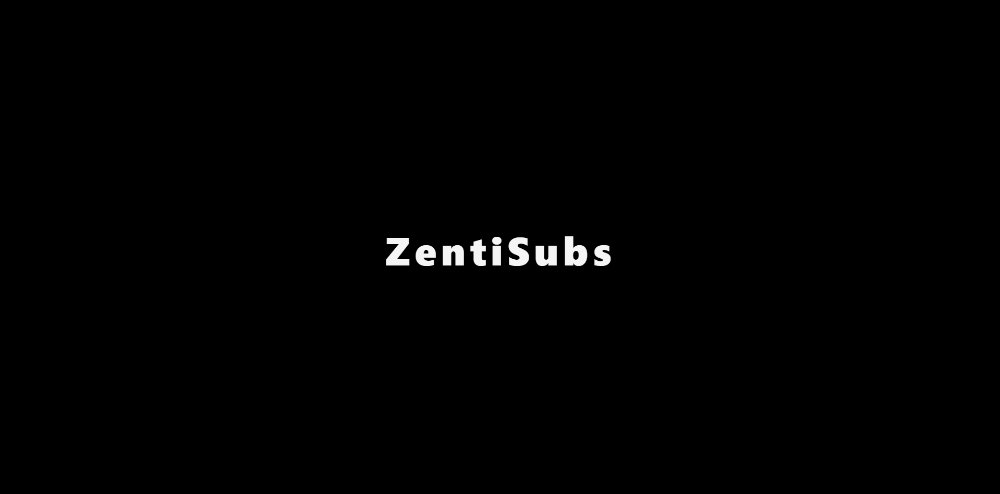
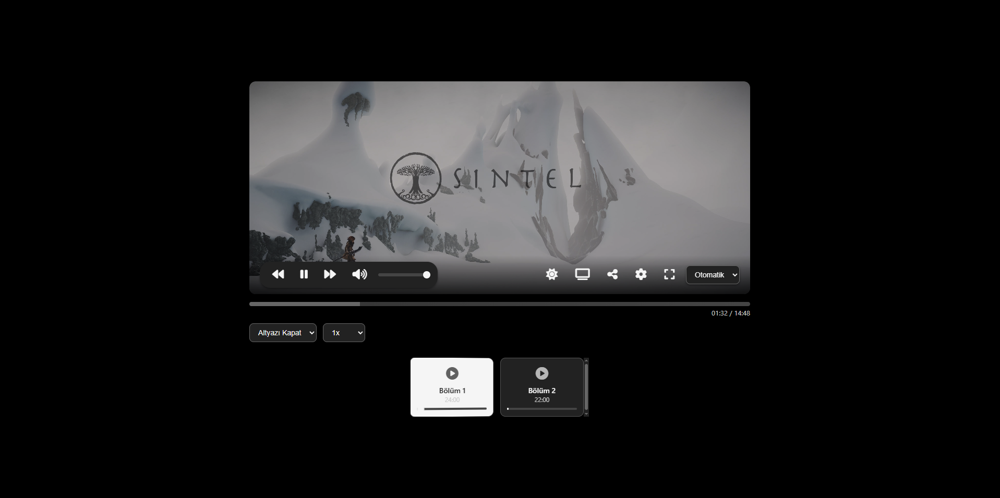

```markdown
# ZentiSubs-Player

ZentiSubs Ultra Premium Anime Player - A modern, responsive, and customizable video player for streaming anime with HLS support, subtitle customization, and mobile optimization. Ready to take your anime experience to galactic heights! 🚀

## Features
- **HLS Support**: Seamless, high-quality video streaming with Hls.js integration.
- **Subtitle Customization**: Adjust subtitle size, color, and background opacity.
- **Fullscreen Mode**: Fullscreen button always visible next to subtitle settings.
- **Theme Support**: Toggle between dark and light themes.
- **Mobile Optimization**: Touch controls and responsive design.
- **Episode Management**: Episode list, playback history, and intro skip feature.
- **Accessibility**: Keyboard shortcuts and screen reader support.
- **Social Sharing**: Share your current episode on the X platform.

## Installation

1. **Clone the Repository**:
   ```bash
   git clone https://github.com/<your-username>/ZentiSubs-Player.git
   cd ZentiSubs-Player
   ```

2. **Dependencies**:
   - The project uses external CDNs for dependencies (Font Awesome and Hls.js). No additional installation is required.

3. **Start a Local Server**:
   - Run `index.html` using a local HTTP server. For example:
     ```bash
     python -m http.server 8000
     ```
   - Open your browser and navigate to `http://localhost:8000`.

4. **Add Your Own Videos**:
   - Update the `episodes` array in `index.html` with your video URLs and subtitle files.

## Usage

- **Playback Controls**:
  - **Spacebar**: Play/Pause
  - **F**: Toggle fullscreen
  - **M**: Mute/Unmute
  - **T**: Toggle subtitles on/off
  - **C**: Open subtitle settings
  - **Q**: Focus quality selector
  - **S**: Focus speed selector
  - **N/B**: Next/Previous episode
  - **Z**: Toggle theme
  - **Arrow Keys**: Control volume and seek
  - **J/L**: Seek backward/forward by 5 seconds

- **Mobile Usage**:
  - Double-tap to seek forward/backward.
  - Three-finger swipe to switch episodes.

- **Subtitle Settings**:
  - Customize subtitle size, color, and background opacity via the settings button in the top-right corner.

## Screenshots

Below are some glimpses of the ZentiSubs-Player in action! 🌟

- **Input Mode (Dark Theme)**: The main player interface with controls and subtitle settings visible.
  

- **Normal Mode (Dark Theme)**: Fullscreen view with the subtitle settings and fullscreen button side by side.
  

## Contributing

Want to help ZentiSubs conquer the galaxy? Contributions are welcome! 🌌

1. Fork the repository.
2. Create a feature branch: `git checkout -b feature/new-feature`
3. Commit your changes: `git commit -m "Added new feature"`
4. Push to the branch: `git push origin feature/new-feature`
5. Open a Pull Request.

Please ensure your contributions align with the project's clean code standards and aesthetic style.

## License

This project is licensed under the [MIT License](LICENSE).

## Contact

Have questions or suggestions? Reach out on [X](https://x.com/) or open an issue.

**Conquer the galaxy with ZentiSubs!** 🚀
```
